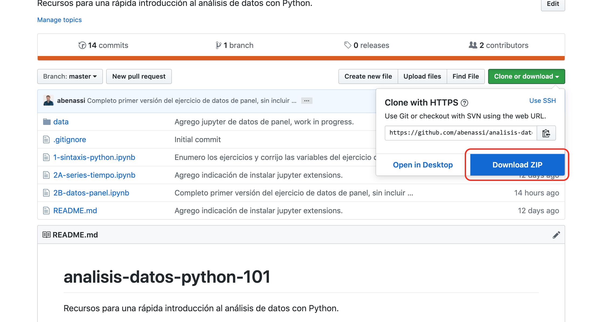

# Análisis de datos en Python

Recursos para una rápida introducción al análisis de datos con Python.

## Secciones

### 1. Introducción a Python

+ **[Descargá e instalá Anaconda](https://www.anaconda.com/distribution/#download-section)** (Python 3, ignorar Python 2)
* **Instalá una librería con extensiones para Jupyter**
    + Abrí la terminal de `Anaconda Prompt`
        - Andá a la carpeta donde instalaste `Anaconda`
        - Click en `Anaconda Prompt`
    + Una vez en la terminal, instalá **jupyter_contrib_nbextensions** ejecutando el siguiente comando: `conda install -c conda-forge jupyter_contrib_nbextensions` (copialo y pegalo en la terminal > Enter)
* **Descargá y descomprimí el repositorio** en tu computadora

+ **Abrí un `Jupyter Notebook`**
    + Andá a la carpeta donde instalaste `Anaconda`
    + Click en `Jupyter Notebook`
    + Navegá el árbol de carpetas hasta encontrar la carpeta del repositorio que descargaste
    + **Abrí y ejecutá celda por celda el [Jupyter de introducción rápida a Python](python-introduccion.ipynb)**. La idea es que te detengas en las explicaciones, veas los ejemplos y resuelvas los breves ejercicios propuestos.

### 2. Exploración de datos

+ [Jupyter de Exploración General](exploracion-general.ipynb) (instalar nuevas librerías desde `Anaconda Prompt`)
    * `pip install geopandas`
    * `pip install descartes`
+ [Jupyter de Series de Tiempo](series-tiempo.ipynb)
+ [Jupyter de Datos de Panel](datos-panel.ipynb) (TBD)

### 3. Mapas y georreferenciación

+ [Jupyter de Mapas](mapas.ipynb) (TBD)
+ [Jupyter de Georreferenciación](georreferenciacion.ipynb) (TBD)

### 4. Presentación de resultados

+ [Jupyter de Informes](informes.ipynb) (TBD)

## Objetivos del repositorio

* Abrir una tabla y hacer exploración inicial
* Graficar
* Cruzar dos tablas
* Hacer un mapa
* Georreferenciar una lista de direcciones
* Hacer un informe
